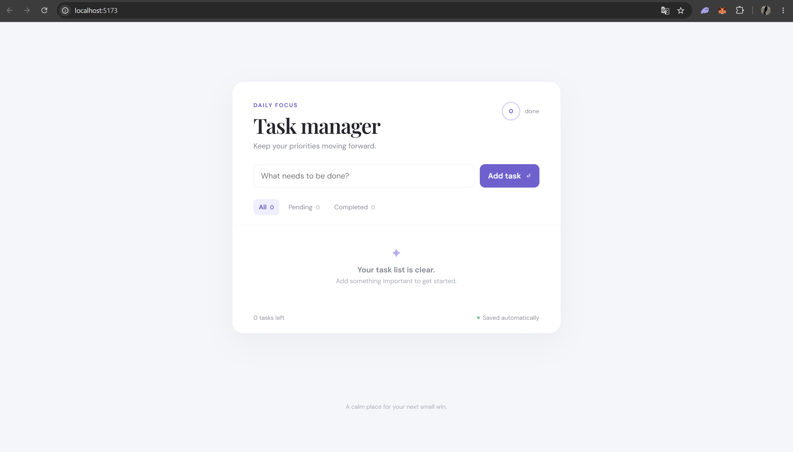

# AI Task Manager

[](https://github.com/simaofop/ai-task-manager/actions/workflows/ci.yml)


A simple task management web application built with React, TypeScript and Vite.

The project was developed using an AI-assisted software development workflow with OpenAI Codex, while keeping human control over requirements, validation, Git history and architectural decisions.

## Live Demo

[](https://ai-task-manager-eight-rho.vercel.app/)

## Preview



## Features

- Add tasks
- Mark tasks as completed
- Delete tasks
- Filter by all, pending and completed
- Persist tasks using localStorage
- Responsive interface

## Tech Stack

- React
- TypeScript
- Vite
- CSS
- Git / GitHub
- OpenAI Codex

## Running Locally

Install dependencies:

```bash
npm install
```

Start the development server:

```bash
npm run dev
```

Create a production build:

```bash
npm run build
```

## Testing

Run the test suite:

```bash
npm test
```

Run the test suite with V8 coverage reporting:

```bash
npm run test:coverage
```

CI runs the production build and tests automatically.

## AI-Assisted Development

OpenAI Codex was used as a development agent for implementation tasks.

My responsibilities included:

- defining requirements;
- selecting the technology stack;
- writing repository instructions in `AGENTS.md`;
- reviewing generated changes;
- testing application behaviour;
- validating production builds;
- managing Git and GitHub;
- documenting the development process.

See [`AI_WORKFLOW.md`](AI_WORKFLOW.md) for more details.

## Project Status

First functional version completed.
